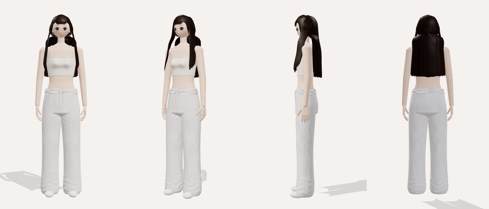
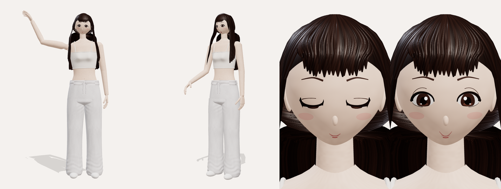

# Companion Avatar (3D)

A rigged, procedural 3D model of the companion character: long dark-brown hair with bangs, a white ribbed cami crop top, heather-grey sweatpants and white socks. It is built entirely in code with three.js, so you can change proportions, colors, hair or expressions in `src/` and re-export.




## What's in the model (`model/companion.glb`)

- **Skeleton:** 51 humanoid bones with VRM-style names (`Hips`, `Spine`, `Chest`, `Neck`, `Head`, `Left/RightShoulder`, `…UpperArm`, `…LowerArm`, `…Hand`, three joints for each finger and thumb, `…UpperLeg`, `…LowerLeg`, `…Foot`, `…Toes`). Every mesh is skinned with smooth weights, and the long hair follows the head near the scalp and the chest lower down.
- **Blendshapes on the `Face` mesh:** `blink`, `blinkLeft`, `blinkRight`, `smile`, `mouthOpen` (the mouth interior and tongue appear as it opens), `browUp`, `browSad`.
- **Animation clips:**
  - `Idle`: breathing, a slight sway and blinks.
  - `Wave`: right-hand wave with a smile.
  - `Talk`: lip movement with nods and a hand gesture.
- **Meshes:** `Body` (skin and clothes, one material per part), `Face` (eye, brow and mouth features) and `Hair` (skull cap plus about 180 textured strand ribbons).
- **Detail:**
  - Hands have a shaped palm, jointed and slightly curled fingers, and nails.
  - The bust is shaped smoothly as part of the torso and the top.
  - The sweatpants have folds: bunching at the ankles, drape and knee shape, gathers under the elastic waistband, and creases at the crotch.
- **Textures** (generated procedurally, embedded as PNG):
  - Hair: strand color and a normal map.
  - Top, waistband and socks: rib-knit normal map.
  - Sweatpants: heather fleece color and normal maps, with side seams.
  - Skin: soft color variation.

The scale is in meters, with Y up and the character facing +Z. She is about 1.65 m tall and stands with her feet at the origin. The file is about 6 MB. It opens in Blender, three.js, Babylon, Unity/Unreal (through a glTF importer) or https://gltf-viewer.donmccurdy.com.

## Files

- `src/buildAvatar.js`: entry point. It assembles the skeleton, skinned meshes, materials and clips.
- `src/body.js`: torso, arms, hands, crop top, sweatpants and socks.
- `src/head.js` and `src/face.js`: head surface, painted-on face features and blendshapes.
- `src/hair.js`: hair cap and strand ribbons.
- `src/rig.js`: bone layout, hand and finger layout, and skin-weight functions.
- `src/animations.js`: the Idle, Wave and Talk clips.
- `src/textures.js`: canvas-painted textures and normal maps.
- `viewer.html`: orbit viewer with clip buttons and blendshape sliders. Serve this folder (for example `npx http-server .`) and open `viewer.html`.

## Rebuilding

The textures are painted on an HTML canvas, so the export runs in headless Chromium through Playwright:

```sh
npm install
npx playwright install chromium   # only needed once, if Chromium isn't already available
npm run export                    # writes model/companion.glb
npm run render -- shots front quarter side back face+smile=1 front:Wave@1.0
```

`render` takes `view[:Clip@seconds][+morph=value]` arguments, where the views are `front`, `quarter`, `side`, `back`, `face` and `hand`. Set `RENDER_SIZE=WxH` to change the image size.
