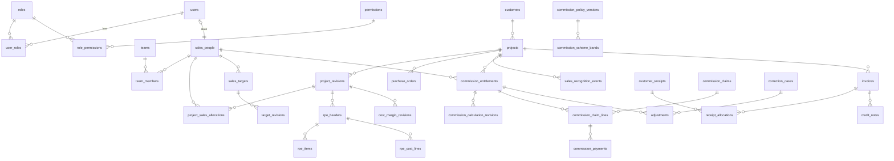

# FASE 0 — Usulan Skema Data & ERD

Pendamping [`FASE-0-AUDIT-ARSITEKTUR.md`](./FASE-0-AUDIT-ARSITEKTUR.md). Ini **usulan**;
DDL final ditulis sebagai migrasi pada Fase 1–4.

## 1. Konvensi

- PostgreSQL 16. PK `uuid` (`gen_random_uuid()`), kecuali `recognition_seq` (`bigint` dari SEQUENCE).
- Uang: `NUMERIC(20,2)` (IDR); nilai mentah komisi `NUMERIC(28,10)`; persentase/rasio
  `NUMERIC(20,10)` (≥ 6 desimal, PRD §29); kurs `NUMERIC(20,8)`. **Tanpa `float`/`real`.**
- Setiap tabel bisnis: `created_at timestamptz`, `created_by uuid FK users`.
- Record final/finansial: **tanpa hard-delete** — trigger `forbid_delete()`; status `void`/`retired`.
- Tabel append-only (`audit_events`, `approval_events`, `commission_calculation_revisions`
  final, `commission_payments`, `adjustments`): trigger `forbid_update_delete()`; app role
  tanpa privilege `UPDATE/DELETE`.
- Data berversi: `effective_from date`, `effective_to date NULL`, `status`
  (`DRAFT|DISETUJUI|AKTIF|PENSIUN`), EXCLUDE constraint `daterange` agar tidak overlap.
- Fixture QA: kolom `is_qa_fixture boolean` pada tabel konfigurasi; gate produksi menolak.

## 2. ERD (ringkas)

## 3. Tabel per Domain

### 3.1 Identitas & Akses (Fase 1)

| Tabel | Kolom kunci | Constraint |
|---|---|---|
| `users` | email, password_hash (argon2id), is_active, last_login_at | UNIQUE lower(email) |
| `roles` | code (`DIREKTUR`, `SALES`, `MANAJER_SALES`, `FINANCE`, `ADMIN_SISTEM`) | UNIQUE code |
| `permissions` | code (mis. `target.approve`, `claim.approve`, `payment.record`) | UNIQUE |
| `role_permissions`, `user_roles` | | PK komposit; `ADMIN_SISTEM` tidak diberi permission `*.approve` (dicek test) |
| `sessions` | user_id, token_hash, expires_at, idle_expires_at | token disimpan sebagai hash |
| `sales_people` | user_id NULL, code, name, is_active, active_from/to | UNIQUE code |
| `teams`, `team_members` | manager_user_id; sales_person_id, valid_from/to | scope Manajer Sales |

### 3.2 Master & Proyek (Fase 1)

| Tabel | Kolom kunci | Constraint |
|---|---|---|
| `customers` | code, name, npwp NULL | UNIQUE code |
| `projects` | id (tetap), reference_no, customer_id, owner_sales_person_id, current_revision_id | UNIQUE reference_no |
| `project_revisions` | project_id, revision_no, sales_value S, oc_amount O, effective_sales_date (usulan), status, reason | UNIQUE(project_id, revision_no); CHECK S>0; CHECK 0≤O≤S |
| `project_sales_allocations` | project_revision_id, sales_person_id, target_contribution_pct, commission_allocation_pct, difference_reason, director_approval_id | UNIQUE(rev, sales); CHECK 0≤pct≤1 (kedua kolom); Σ=1 dicek saat finalisasi (deferred trigger) |
| `purchase_orders` | project_id, po_no, po_date, amount | UNIQUE(project_id, po_no) |

### 3.3 RPE & Cost/Margin (Fase 1)

| Tabel | Kolom kunci | Constraint |
|---|---|---|
| `cost_categories` | code, name, covered_by_factor | — |
| `cost_factor_versions` | origin (`LOKAL/IMPOR/JASA`), item_kind (`HARDWARE/SOFTWARE`), factor, effective range, status, is_qa_fixture | factor>0; EXCLUDE overlap per (origin, kind) |
| `pricelist_divisor_versions` | divisor d, effective range, status | CHECK d>0 |
| `rpe_headers` | project_revision_id, status, verified_by/at | |
| `rpe_items` | supplier, qty, unit_price, currency, fx_rate, fx_date, fx_source, fx_attachment_id, origin, item_kind, supplier_value_idr | CHECK qty>0, unit_price≥0, fx_rate>0; CHECK currency='IDR' ⇒ fx_rate=1 |
| `rpe_cost_lines` | rpe_header_id, cost_category_id, amount, covered_by_factor (snapshot) | CHECK amount≥0; tolak baris bila kategori `covered_by_factor=true` (anti double-count) |
| `cost_margin_revisions` | project_revision_id, C, d, P, S, O, A, margin_before(_pct), margin_after(_pct NULL=N/A), discount_pct, oc_equiv_pct, total_disc_oc_pct, factor_version_ids, formula_version | CHECK C≥0, P>0 |

### 3.4 Target (Fase 1)

| Tabel | Kolom kunci | Constraint |
|---|---|---|
| `sales_targets` | sales_person_id, year, quarter, current_revision_id | UNIQUE(sales, year, quarter); CHECK quarter 1–4 |
| `target_revisions` | sales_target_id, revision_no, target_amount, status, approved_by | CHECK target_amount>0; UNIQUE(target, revision_no) |

### 3.5 Pengakuan, Aturan & Kalkulasi (Fase 2)

| Tabel | Kolom kunci | Constraint |
|---|---|---|
| `recognition_sequences` | SEQUENCE `recognition_seq` + tabel registri | nextval atomik |
| `sales_recognition_events` | project_id, recognition_seq, effective_date, year, quarter, status (`AKTIF/DIBATALKAN/DIGANTIKAN`), verified_by, supersedes_event_id | UNIQUE recognition_seq; seq immutable (trigger); satu event AKTIF per proyek (partial unique) |
| `grade_rule_versions` | bands JSONB (grade, lower, upper, inclusivity), effective range, status | EXCLUDE overlap |
| `commission_policy_versions` | metric (`TOTAL_DISKON_OC`), domain_min, domain_max, effective range, status, approved_by, is_qa_fixture | satu metrik per versi; EXCLUDE overlap tanggal |
| `commission_scheme_bands` | policy_version_id, grade, lower_discount, upper_discount NULL, lower_inclusive, upper_inclusive, commission_rate | CHECK grade 1–4; CHECK 0≤rate≤1 dan NOT NULL; EXCLUDE overlap `numrange` per (version, grade); validator gap pada aktivasi |
| `rounding_policies` | currency_scale (0 = Rp1), mode (`HALF_UP`), pct_scale, status | |
| `business_decisions` | code (K1–K6), version, status, value JSONB, effective_from, evidence_attachment_id, decision_maker, approved_by | UNIQUE(code, version); satu AKTIF per code per tanggal |
| `commission_entitlements` | project_id, sales_person_id, entitlement_type, current_final_revision_id, eligibility_status | **UNIQUE(project_id, sales_person_id, entitlement_type)** |
| `commission_calculation_revisions` | entitlement_id, revision_no, mode (`SIMULASI/PRODUKSI`), status (`DRAFT/TERHITUNG/FINAL_DISETUJUI/TERBLOKIR`), block_reasons JSONB, **seluruh field snapshot PRD §13**, input_snapshot JSONB, input_hash, engine_version, calculated_by/at | UNIQUE(entitlement, revision_no); partial unique: satu FINAL_DISETUJUI aktif per entitlement; immutable setelah final |

### 3.6 Piutang & Eligibility (Fase 3)

| Tabel | Kolom kunci | Constraint |
|---|---|---|
| `invoices` | project_id, invoice_no, invoice_date, amount, status | UNIQUE invoice_no; CHECK amount>0 |
| `customer_receipts` | customer_id, receipt_date, amount, reference, verified_by | CHECK amount>0 |
| `receipt_allocations` | receipt_id, invoice_id, amount | CHECK amount>0; Σ per receipt ≤ receipt.amount (trigger) |
| `credit_notes` | invoice_id, amount, reason, status, approved_by | |
| `disputes` | project_id/invoice_id, type (`DISPUTE/REFUND/RETUR`), status | |
| `eligibility_evaluations` | entitlement_id, result, checks JSONB, verified_by | append-only |

### 3.7 Klaim & Pembayaran (Fase 3)

| Tabel | Kolom kunci | Constraint |
|---|---|---|
| `commission_claims` | claimant_sales_person_id, submitted_by, status, approved_by, idempotency_key | CHECK approved_by ≠ submitted_by |
| `commission_claim_lines` | claim_id, entitlement_id, amount, status | **partial UNIQUE(entitlement_id) WHERE status IN (aktif)**; CHECK amount>0 |
| `commission_payments` | claim_line_id, entitlement_id, amount, paid_at, method, reference, reverses_payment_id NULL, idempotency_key | append-only; reversal = baris baru; CHECK amount≠0 |
| `idempotency_records` | key, scope, actor_id, request_hash, response JSONB, status | **UNIQUE(scope, key)** |

### 3.8 Koreksi & Periode (Fase 4)

| Tabel | Kolom kunci | Constraint |
|---|---|---|
| `correction_cases` | type, earliest_affected_event_id, impact_simulation JSONB, status, approved_by | |
| `adjustments` | entitlement_id, correction_case_id, amount (±), old_approved_revision_id, new_revision_id | append-only |
| `overpayment_cases` | entitlement_id, amount, status, resolution_note | tanpa pemotongan otomatis |
| `period_locks` | year, quarter, status (`TERBUKA/DIUSULKAN_TUTUP/TERKUNCI/REOPEN`), proposed_by, approved_by | UNIQUE(year, quarter) |
| `period_reopen_requests` | period_lock_id, reason, impact_simulation, requested_by, approved_by | CHECK approved_by ≠ requested_by |

### 3.9 Lintas Domain

| Tabel | Kolom kunci | Catatan |
|---|---|---|
| `approval_events` | object_type, object_id, action, actor, decision, reason | append-only |
| `audit_events` | actor_id, occurred_at, object_type, object_id, action, old_value JSONB, new_value JSONB, reason, request_id, approval_event_id | append-only; ditulis dalam transaksi yang sama; redaksi field sensitif |
| `company_settings` | timezone, nama perusahaan, versi | berversi |
| `theme_settings` | logo_attachment_id, color tokens | default tema netral |
| `attachments` | storage_key, sha256, mime, size, uploaded_by | tanpa hard-delete bila direferensikan |

## 4. View Agregat (untuk konsistensi T21)

- `v_sales_quarter_totals` — per (sales, tahun, kuartal): target, Σ S × kontribusi (event AKTIF),
  achievement, Grade Tercapai.
- `v_entitlement_balances` — final dasar, adj+, adj−, bayar sah, reservasi klaim aktif,
  saldo hak, saldo bebas.
- `v_company_sales_totals` — Σ S per proyek **sekali** (bukan via alokasi).

Dashboard, laporan, dan export membaca view yang sama dengan filter yang sama.
